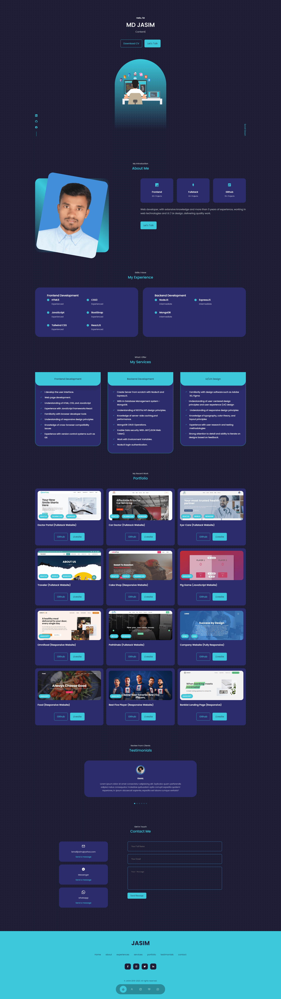

<h2>About the project</h2>

👉 Live Demo: <a target="_blank" href='https://ismailjosim.netlify.app/'>Personal Portfolio</a>

<h3>Build with:</h3>

* ReactJS
* CSS3
* JavaScript
* swiper slider
* React Icons
* react-typed
* lottie-react
* emailjs

<h2>Screenshots of the Project 📸</h2>
 

